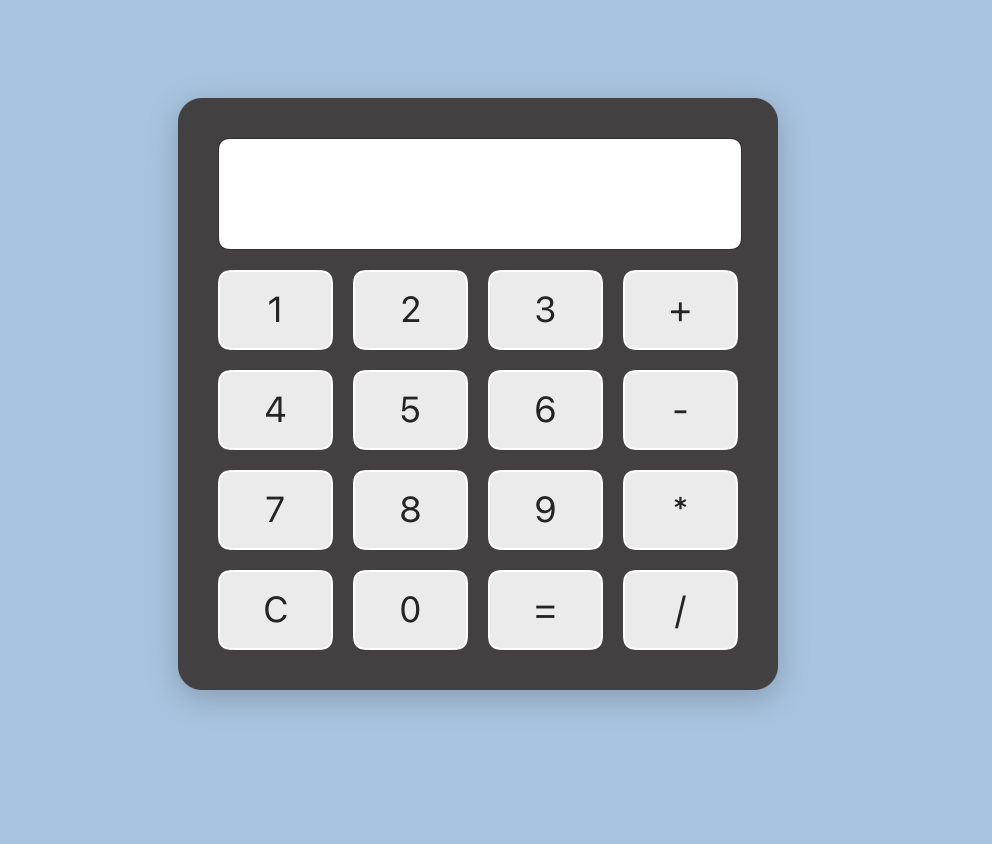
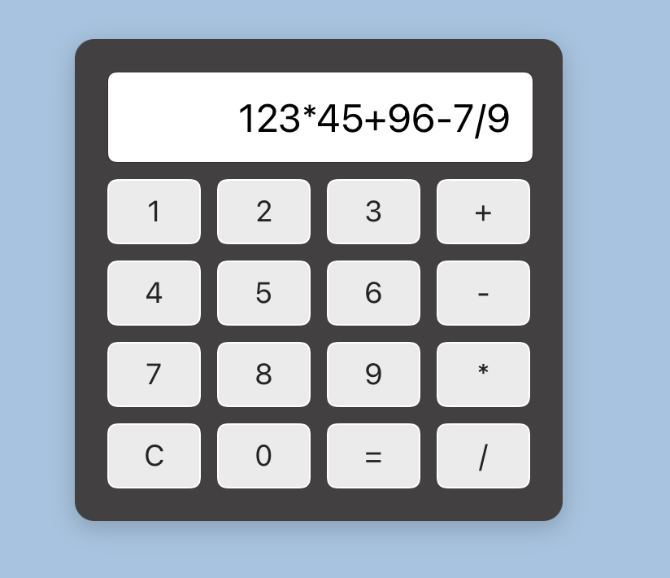

# React Calculator

Мини-калькулятор на React с базовыми операциями: сложение, вычитание, умножение, деление.

## GitHub Pages

https://ne4el.github.io/React-TIP-/

## Возможности

- Нажатие кнопок для ввода чисел и операций
- Очистка экрана
- Вычисление результата

## Технологии

- React (функциональные компоненты, useState)
- CSS для стилизации

## Скриншоты
- Рабочий калькулятор:

- Ввод

- Вывод


## Запуск локально

```bash
npm install
npm start


